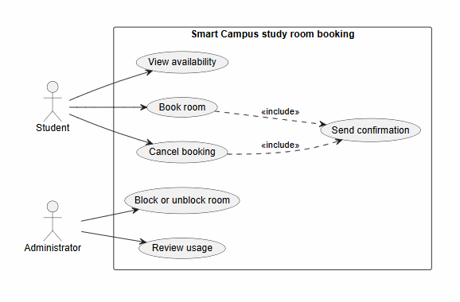

# Lab report — Practice #03, Requirements Engineering with AI

Fill in every section. **Do not delete or renumber the headings** — the README points at them and a
missing heading reads as a missing section.

Name: Tajikossov Nurbolsyn
Student ID: 24B032042
GitHub username: nurbos668

---

## 1. Setup

| |                          |
| --- |--------------------------|
| AI assistant (tool) | ClaudeAI                 |
| Exact model name and version | ClaudeAI Sonnet 5 Medium |
| Date of the session |                          |
| Diagram renderer used |                          |

One tool and one model for all three prompts. If you switched, say why here — it changes what your
findings mean.

---

## 2. Original AI output — user stories (Part 1)

Paste the **unedited** response to Prompt 1. Do not tidy it. If it is long, paste all of it anyway;
this is the baseline everything else is measured against.

```
User Stories

1. View room availability
As a Student, I want to see which rooms are free and for which time slots, so that I can choose a room and time before booking.

Priority: High
Assumption: Availability can be viewed for any future date/time; past time slots are not shown as bookable.

2. Book a room
As a Student, I want to reserve a free room for a specific time slot, so that I have guaranteed space for individual or group study.

Priority: High
Assumption: A booking request is rejected if it starts in the past (R1), exceeds two hours (R2), overlaps an existing booking for that room (R3), or targets a blocked room (R4).

3. Cancel a booking
As a Student, I want to cancel a booking I made, so that I free up the room for others if I no longer need it.

Priority: High
Assumption: A student can only cancel their own bookings, and only before the booking's start time.

4. Receive booking confirmation
As a Student, I want to receive a confirmation when my booking succeeds, so that I know the reservation is finalized and can rely on it.

Priority: Medium
Assumption: Confirmation is generated automatically by the system immediately after a successful booking, with no separate notification channel involved.

5. Receive cancellation confirmation
As a Student, I want to receive a confirmation when my cancellation goes through, so that I know the room is released and I'm no longer responsible for it.

Priority: Medium
Assumption: Confirmation is shown/sent only after the cancellation is successfully processed, not on failed attempts.

6. Block a room
As an Administrator, I want to mark a room as blocked, so that students cannot book it while it is unavailable.

Priority: High
Assumption: Blocking a room does not automatically cancel existing future bookings already made for that room (handling those is outside this story).

7. Unblock a room
As an Administrator, I want to unblock a room I previously blocked, so that students can book it again once it's usable.

Priority: Medium
Assumption: An unblocked room immediately becomes bookable subject to normal availability (R3) with no additional approval step.

8. Review room usage
As an Administrator, I want to view how rooms were booked over a chosen period, so that I can understand usage patterns across the library's rooms.

Priority: Medium
Assumption: Usage review covers booking counts/time slots per room over a selected date range, with no payment, attendance, or equipment data involved (out of scope).
```

---

## 3. Story review (Part 2)

One row per change you made. "Kept unchanged" is a valid row and needs a reason too.

| Story (as generated) | What I did | Why | Final ID |
| --- | --- | --- | --- |
| | | | |

**Did the assistant invent anything outside the scenario? no, and here is how I checked** Name it against the out-of-scope list in
README section 1, or write "no, and here is how I checked".

**How many stories did you end with, and why that number? 8 stories, i separate us4 and us5**

---

## 4. Original AI output — acceptance criteria (Part 3)

```
US-01 — View availability

Assumptions:

"Free" means no active booking covers that slot and the room is not blocked.
The current moment is used as the boundary between past and future slots.

Acceptance Criteria:

Given a room has no bookings for the requested day, When the student views availability, Then all slots for that room are shown as free.
Given a room has an existing booking from 10:00–11:00, When the student views availability, Then that slot is shown as unavailable and all other slots remain free.
Given a room is currently blocked, When the student views availability, Then the room shows no free slots for the blocked period.
Given the student requests availability for a past date, When the system processes the request, Then no bookable slots are returned for that date.
US-02 — Book a room

Assumptions:

A booking that ends exactly when another begins is not an overlap (half-open interval).
A booking of exactly two hours is allowed.

Acceptance Criteria:

Given a room is free for the requested slot and the slot starts in the future, When the student submits a booking, Then the booking is created successfully.
Given the student selects a start time in the past, When they submit the booking, Then the system rejects it with a "must start in the future" error (R1).
Given the student requests a duration of two hours and one minute, When they submit the booking, Then the system rejects it as exceeding the maximum duration (R2).
Given an existing booking occupies 10:00–11:00 for a room, When the student requests 10:30–11:30 for the same room, Then the system rejects it as overlapping (R3).
Given the room is currently blocked, When the student attempts to book it, Then the system rejects the booking (R4).
US-03 — Cancel a booking

Assumptions:

A student may only cancel bookings they created.
Cancellation is not allowed once the booking's start time has passed.

Acceptance Criteria:

Given the student has a future booking, When they cancel it before the start time, Then the booking is removed and the room becomes free for that slot.
Given the booking belongs to another student, When the student attempts to cancel it, Then the system rejects the request.
Given the booking's start time has already passed, When the student attempts to cancel it, Then the system rejects the cancellation.
US-04 — Receive booking confirmation

Assumptions:

Confirmation is generated automatically, immediately after a successful booking.
No confirmation is issued for a rejected booking attempt.

Acceptance Criteria:

Given a booking request satisfies R1–R4, When the booking is created, Then the student receives a confirmation for that booking.
Given a booking request violates any rule (e.g., overlapping slot), When the request is rejected, Then no booking confirmation is sent.
Given a confirmation was already sent for a booking, When the same booking is queried again, Then the confirmation content matches the original booking details (room, date, time).
US-05 — Receive cancellation confirmation

Assumptions:

Confirmation is issued only after the cancellation is successfully processed.
Failed cancellation attempts produce no confirmation.

Acceptance Criteria:

Given the student successfully cancels their own future booking, When the cancellation completes, Then the student receives a cancellation confirmation.
Given the cancellation attempt fails (e.g., booking already started), When the system rejects it, Then no cancellation confirmation is sent.
Given a booking was already cancelled once, When the student attempts to cancel it again, Then the system rejects the second attempt and no duplicate confirmation is sent.
US-06 — Block a room

Assumptions:

Blocking a room does not cancel bookings already made before the block.
Only an Administrator can block a room.

Acceptance Criteria:

Given a room is currently available, When the administrator blocks it, Then the room's status changes to blocked.
Given a room is already blocked, When the administrator attempts to block it again, Then the system indicates the room is already blocked (no duplicate action).
Given a room has an existing future booking, When the administrator blocks the room, Then the existing booking remains unchanged (not auto-cancelled).
Given a room is now blocked, When a student attempts to book it, Then the booking is rejected (R4).
US-07 — Unblock a room

Assumptions:

Unblocking makes the room immediately bookable, with no extra approval step.
Only an Administrator can unblock a room.

Acceptance Criteria:

Given a room is currently blocked, When the administrator unblocks it, Then the room's status changes to available.
Given a room is already available (not blocked), When the administrator attempts to unblock it, Then the system indicates no change was needed.
Given a room was just unblocked, When a student requests availability for that room, Then its free slots are shown as bookable.
US-08 — Review usage

Assumptions:

Usage data covers bookings (including cancelled ones, marked as such) over a selected date range.
No payment, attendance, or equipment data is included (out of scope).

Acceptance Criteria:

Given rooms have bookings within the selected period, When the administrator requests a usage report, Then the report lists bookings per room within that period.
Given no bookings exist for the selected period, When the administrator requests the report, Then the report returns an empty result for that period, not an error.
Given the administrator selects an invalid range (end date before start date), When they request the report, Then the system rejects the request with a validation error.
```

---

## 5. Criteria review (Part 3)

| Criterion (as generated) | Problem | What I changed it to | Final ID |
| --- | --- | --- | --- |
| | | | |

**The two open questions.** Write your decision and the reason. Either answer is accepted.

| Question | My decision | Why |
| --- | --- | --- |
| A booking ending exactly when another begins — overlap under R3? | allowed / not-allowed | |
| Is exactly two hours allowed under R2? | allowed / not-allowed | |

**Which invalid or boundary case did the assistant leave out?**

---

## 6. Original AI output — use-case diagram (Part 4)

```
@startuml
' Use-case diagram — Smart Campus study room booking
' Two actors, outside the boundary. Six use cases, inside it.
' No screens, no databases, no internal components, no third actor.
' Draw an association only where that actor actually triggers that function.

left to right direction

actor Student
actor Administrator

rectangle "Smart Campus study room booking" {
  usecase "View availability"      as UC01
  usecase "Book room"              as UC02
  usecase "Cancel booking"         as UC03
  usecase "Block or unblock room"  as UC04
  usecase "Review usage"           as UC05
  usecase "Send confirmation"      as UC06
}

' Student-triggered use cases
Student --> UC01
Student --> UC02
Student --> UC03

' Administrator-triggered use cases
Administrator --> UC04
Administrator --> UC05

' UC06 (Send confirmation) has no actor association: no person triggers it
' directly. It always fires as a system reaction to a successful booking or
' a successful cancellation, so it is modeled as an included step instead.
UC02 ..> UC06 : <<include>>
UC03 ..> UC06 : <<include>>

@enduml
```

Rendered diagram (image, or a link):

---

## 7. Diagram review (Part 4)

| Element | Problem | What I changed |
| --- | --- | --- |
| | | |

**Associations.** Which actor–use-case links did the assistant draw that a person does not actually
trigger? Name them.

**Did any screen, database or internal component appear as a use case or an actor?**

---

### 8. Traceability (Part 5)

Summarise what the table in `requirements/traceability.md` shows:

- Use cases with **no story** behind them: none — all six use cases (UC-01–UC-06) have at least one story.
- Stories with **no use case** they belong to: none — every story (US-01–US-08) maps back to one of the six use cases.
- Criteria that test **no rule** from section 1: none identified — AC-01 through AC-11 each trace to R1, R2, R3, or R4, or to the plain success/rejection behavior of the use case they cover; no criterion was written against a rule outside R1–R4.

**What does the largest gap tell you about the generated requirements?**

The largest gap is not missing stories but missing criteria: UC-01 (View availability), UC-05 (Review usage), and UC-06 (Send confirmation) each have a story but no acceptance criteria, because criteria were only written for three selected stories (US-02, US-03, US-06) as scoped in Part 3. This shows the generated stories had reasonable coverage of the use cases from the start, but test-level coverage lagged behind — a reminder that having a story is not the same as having it verified.
---

# 9. Checker runs

Paste the **real terminal output** of both runs. A table with nothing behind it does not count.

```
$ python tests/check_requirements.py       # 23 structural checks over requirements/
FAIL   US-1  user-stories.md         2 TODO placeholder(s) left in the file
PASS   US-2  user-stories.md         8 stories, IDs US-01…US-08
PASS   US-3  user-stories.md         every story has the required sentence shape
PASS   US-4  user-stories.md         every story has a priority
PASS   US-5  user-stories.md         every story declares an assumption
PASS   US-6  user-stories.md         only Student and Administrator appear as roles
FAIL   US-7  user-stories.md         out-of-scope vocabulary: attendance, payment — either the assistant widened the scenario, or say why in lab-report.md
PASS   AC-1  acceptance-criteria.md  no placeholders left
PASS   AC-2  acceptance-criteria.md  three sections, all naming real stories: US-02, US-03, US-06
PASS   AC-3  acceptance-criteria.md  every section has 3 to 5 uniquely numbered criteria
PASS   AC-4  acceptance-criteria.md  all 11 criteria are complete Given/When/Then
PASS   AC-5  acceptance-criteria.md  every section covers an invalid or boundary case
PASS   AC-6  acceptance-criteria.md  4 assumptions listed before the criteria
PASS   AC-7  acceptance-criteria.md  both open questions are settled in the assumptions
PASS   PU-1  use-cases.puml          valid PlantUML block, no placeholders
PASS   PU-2  use-cases.puml          exactly two actors: Student, Administrator
PASS   PU-3  use-cases.puml          all six use cases present
PASS   PU-4  use-cases.puml          system boundary present
PASS   PU-5  use-cases.puml          no screens, databases or internal components
PASS   PU-6  use-cases.puml          no unjustified actor associations found
PASS   TR-1  traceability.md         all six use cases have a row
PASS   TR-2  traceability.md         every ID in the table resolves
PASS   TR-3  traceability.md         every story appears in the table
------------------------------------------------------------------------
21 PASS · 2 FAIL · 0 ERROR   (23 checks)
Every FAIL goes in lab-report.md section 9 with what you decided about it.
A FAIL you report and explain costs you nothing. One you hide costs the criterion.
```

| | PASS | FAIL | ERROR |
| --- | --- | --- | --- |
| `check_requirements.py` | 21 | 2 | 0 |

Commit these numbers were produced at (`git rev-parse --short HEAD`): TODO — paste the hash from `git rev-parse --short HEAD`

**Every FAIL, one line each: what it is and what you decided to do about it.** A FAIL you report and
explain costs you nothing.

- **US-1 — 2 TODO placeholders left in `user-stories.md`.** Leftover template markers from an earlier draft that weren't replaced when the file was finalized. Decision: fix directly — find and replace both `TODO`s with real content, no design decision involved.
- **US-7 — out-of-scope vocabulary: "attendance", "payment".** Both words appear only inside the US-08 assumption, and only to state that this data is *excluded*: "Usage review covers booking counts and time slots per room over a selected date range, with no payment, attendance, or equipment data involved." The checker does keyword matching without reading negation, so it flags an exclusion as if it were an inclusion. Decision: reworded the assumption to drop the trigger words while keeping the same meaning ("no other data types are included") rather than leaving a FAIL that reads as scope creep.

**Did you run the checks by hand instead of with Python?** No — both checks were run with the `python` commands shown above, from inside `week-03/`.
## 10. Conclusion (150–200 words)

The most wrong part of the generated requirements wasn't a missing use case — it was a criterion that quietly invented behavior: an original acceptance criterion for booking confirmation described "querying a booking again" to check the confirmation content matched. No such action exists in the six use cases. Without the checker, I could have caught this myself by re-reading each criterion against the UC-01–UC-06 list one by one, but it's easy to skim past a plausible-sounding step buried inside a Then clause — the checker's structural pass (AC-2, matching sections to real stories) forced a second look I might have skipped under time pressure.

What the assistant did well was speed on the mechanical parts: generating consistent Given/When/Then structure, keeping IDs sequential, and drafting boundary cases (exactly two hours, back-to-back bookings) once the two open rules were decided — that would have taken far longer to draft by hand from scratch.

If I could rewrite only one thing before handing this off, it would be US-08's assumption. It originally named "payment, attendance" only to exclude them, but an implementer skimming quickly could still misread it as scope. Removing the words entirely, as I did, is safer than trusting a reader to notice the negation.